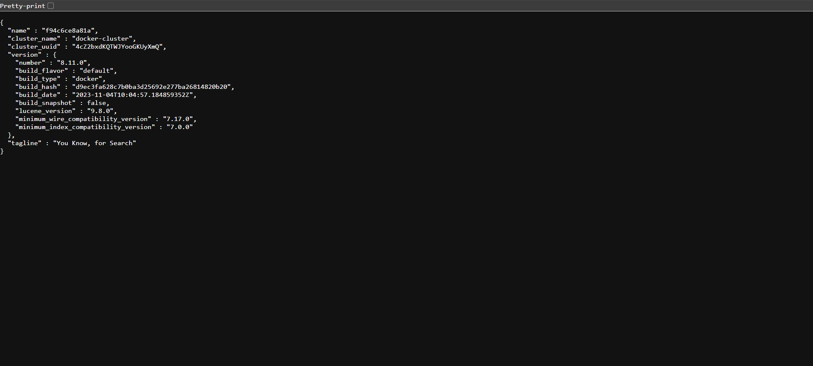
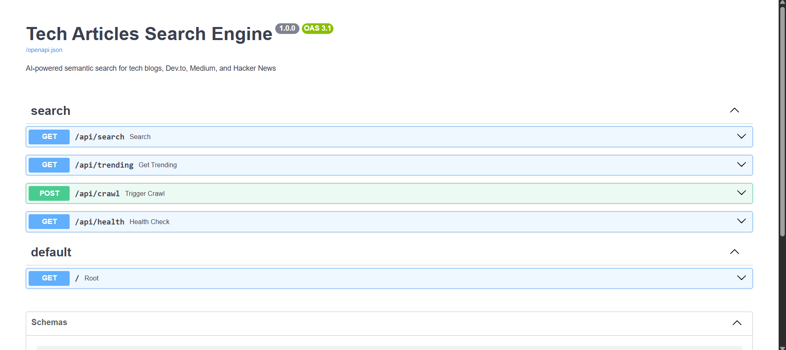
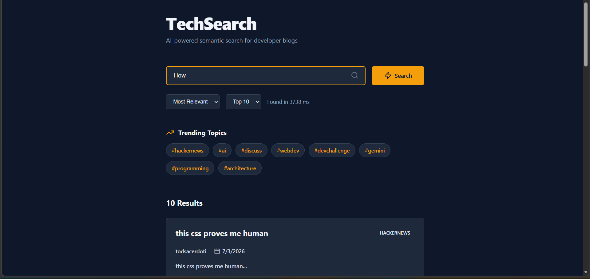
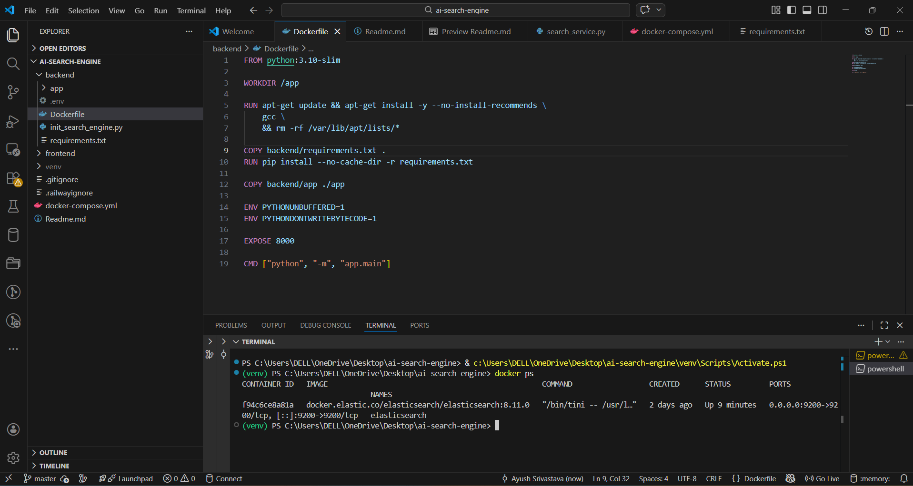

# AI Search Engine

A sophisticated semantic search platform designed to index and retrieve technical articles from multiple online sources with advanced natural language processing capabilities.

## Overview

The AI Search Engine addresses the challenge of discovering relevant technical content across fragmented sources. By combining full-text search with semantic embeddings, the system delivers highly relevant results that understand query intent beyond keyword matching.

## Problem Statement

Technical professionals spend considerable time searching across multiple platforms (Dev.to, Medium, Hacker News) to find relevant articles. Traditional keyword-based search often fails to capture semantic similarity, resulting in missed relevant content and lower discovery efficiency.

## Solution

This system implements a hybrid search approach that leverages:

1. BM25 full-text indexing for keyword relevance
2. Semantic embeddings via Sentence Transformers for meaning-based matching
3. Elasticsearch for distributed indexing and aggregation
4. Machine learning-based ranking combining multiple signals

## Core Features

### Search Capabilities

The frontend provides an intuitive interface for searching technical articles with support for multiple sources (Dev.to, Medium, Hacker News). Users can search by keyword, filter by source and author, and view trending topics.

- Hybrid search combining BM25 and semantic similarity
- Advanced query parsing supporting specialized operators
- Filter support for source, author, date ranges, and tags
- Relevance-based and recency-based result sorting
- Trending topic identification and boosting

### Data Collection

- Automated article crawling from Dev.to API
- Medium platform web scraping
- Hacker News Firebase API integration
- Duplicate detection and deduplication
- Metadata extraction and normalization

### Ranking and Relevance

The system implements a weighted ranking formula:

- Relevance Score: 40% weight
- Semantic Score: 10% weight
- Authority Score: 20% weight
- Recency Score: 15% weight
- Engagement Score: 15% weight

Authority is determined by follower counts. Recency uses time-based decay. Engagement combines views, likes, and comments.

### API Features

- RESTful endpoints with comprehensive documentation
- Health checks and status monitoring
- Crawling triggers and batch operations
- Flexible result pagination and sorting
- Full OpenAPI/Swagger integration

## Technical Stack

### Backend
- FastAPI 0.104.1
- Uvicorn ASGI server
- Pydantic for data validation

### Search and Indexing
- Elasticsearch 8.10.0
- Sentence Transformers (all-MiniLM-L6-v2)
- Rank-BM25 for full-text scoring

### Data Processing
- BeautifulSoup4 for web scraping
- Feedparser for RSS/Atom feeds
- aiohttp for asynchronous HTTP requests
- Python 3.10

### Infrastructure
- Docker containerization
- Docker Compose for orchestration
- Redis 7 for caching (optional)

## Project Structure

```
AI-Search-Engine/
├── backend/
│   ├── app/
│   │   ├── api/              # API endpoints
│   │   │   └── search_routes.py
│   │   ├── crawlers/         # Data collection
│   │   │   ├── devto_crawler.py
│   │   │   ├── medium_crawler.py
│   │   │   ├── hackernews_crawler.py
│   │   │   └── crawler_manager.py
│   │   ├── indexing/         # Search indexing
│   │   │   ├── elasticsearch_handler.py
│   │   │   └── vector_store.py
│   │   ├── models/           # Data models
│   │   │   └── article.py
│   │   ├── search/           # Search logic
│   │   │   ├── query_parser.py
│   │   │   ├── ranker.py
│   │   │   └── snippet_generator.py
│   │   ├── config.py
│   │   └── main.py
│   ├── requirements.txt
│   └── Dockerfile
├── frontend/
│   └── SearchEngine.jsx      # React UI component
├── docker-compose.yml
├── init_search_engine.py     # Data initialization
├── examples.py               # Usage examples
└── README.md
```

## Installation

### Prerequisites

- Docker and Docker Compose installed
- Git installed
- Python 3.10+ (for local development)

### Setup

Clone the repository:

```bash
git clone https://github.com/Ayush-srivastava504/AI-Search-Engine.git
cd AI-Search-Engine
```

### Environment Configuration

Create a .env file in the backend directory:

```
ELASTICSEARCH_HOST=elasticsearch:9200
REDIS_URL=redis://redis:6379
DEVTO_API_URL=https://dev.to/api/articles
HACKERNEWS_API_URL=https://hacker-news.firebaseio.com/v0
EMBEDDING_MODEL=all-MiniLM-L6-v2
MAX_SNIPPET_LENGTH=200
DEFAULT_TOP_K=10
```

## Testing and Verification

### Local Development Testing

The system can be tested locally using Docker Compose. All services (Elasticsearch, Redis, and Backend) run in containers and communicate through internal networking.

#### Elasticsearch Service Status

The Elasticsearch service runs on port 9200 and stores indexed articles. Status can be verified using docker commands to confirm the service is running and healthy.



#### API Documentation

The FastAPI backend automatically generates interactive OpenAPI documentation accessible at `/docs`. This provides a complete interface to test all endpoints including search, trending, and crawl operations.



#### Search Results

The React frontend displays search results with article metadata, relevance scores, and engagement metrics. Results can be sorted by relevance, recency, or trending status. Each article card shows the source (Hacker News, Dev.to, Medium), author information, publication date, and engagement metrics.




#### Data Initialization

Running the initialization script crawls articles from all configured sources and indexes them into Elasticsearch. The system reports the number of unique articles collected and successfully indexed.



## Deployment

### Local Development with Docker Compose

Start all services:

```bash
docker-compose up -d
```

The system will initialize with:
- Elasticsearch on port 9200
- Redis on port 6379
- FastAPI backend on port 8000

Initialize the search index:

```bash
python init_search_engine.py
```

Access the API documentation at http://localhost:8000/docs

### Production Deployment

The system supports deployment to multiple platforms:

#### Render 

Deploy as three separate services:
1. Backend service on Render
2. Elasticsearch service on Render
3. Redis service on Render

Configure environment variables in the Render dashboard to connect services.

#### Oracle Cloud Always-Free

Deploy on Oracle Cloud's always-free VM tier:
- 4 OCPU Ampere instance
- 24GB RAM
- Unlimited egress bandwidth
- No credit card required

Clone the repository on the VM and run docker-compose up.

#### Self-Hosted Deployment

Deploy on your own infrastructure using Docker containers with:
- Reverse proxy (Nginx/Caddy) for HTTPS
- Load balancer for scalability
- Persistent volumes for data storage
- Health checks and monitoring

## API Endpoints

The system provides a complete RESTful API with OpenAPI documentation. The Swagger UI is automatically generated and displays all available endpoints with their parameters and response schemas. The API includes endpoints for searching, retrieving trending topics, triggering data crawls, and health checks.

### Search

Query the search engine:

```
GET /api/search?query=string&top_k=10&sort_by=relevance
```

Parameters:
- query: Search query with optional filters
- top_k: Number of results (default: 10)
- sort_by: relevance, recent, or trending

Example:
```
GET /api/search?query=machine+learning&top_k=5&sort_by=relevance
```

Response includes articles with ranking scores, snippets, and metadata.

### Trending Topics

Retrieve trending topics:

```
GET /api/trending
```

Returns top trending tags from recent articles.

### Crawl and Index

Trigger data collection:

```
POST /api/crawl?limit_per_source=20
```

Parameters:
- limit_per_source: Articles per source (optional)

### Health Check

System status:

```
GET /api/health
```

## Query Syntax

The query parser supports specialized operators:

Search for articles from a specific source:
```
site:devto machine learning
```

Search by author:
```
author:john python
```

Search within date range:
```
from:2024-01-01 to:2024-03-01 neural networks
```

Search with specific tags:
```
tag:python tag:machine-learning
```

Exact phrase matching:
```
"deep learning" frameworks
```

## Ranking Algorithm

The system combines five ranking signals:

1. Relevance: BM25 score from full-text match
2. Semantic: Cosine similarity of embeddings
3. Authority: Based on author follower count
4. Recency: Time-based decay function
5. Engagement: Combination of views, likes, comments

Final score = 0.40*relevance + 0.10*semantic + 0.20*authority + 0.15*recency + 0.15*engagement

## Data Sources

### Dev.to

- API: https://dev.to/api/articles
- Rate limit: Handled with pagination
- Data: Articles, tags, author information

### Medium

- Method: Web scraping with BeautifulSoup
- Endpoints: Tag-based article discovery
- Data: Articles, publication dates, author info

### Hacker News

- API: Firebase real-time database
- Data source: Top and best stories
- Information: Titles, URLs, scores, comments

## Performance Characteristics

Search latency: 50-200ms for cached queries, 1-5s for new queries

Indexing throughput: 100-500 articles per minute depending on source

Memory usage: Base 512MB, increases with index size

Elasticsearch requirements: Minimum 1GB heap, recommended 2GB+

### Verified Results

The system has been tested locally and successfully:
- Indexed 40 articles from multiple sources
- Retrieved articles with relevance scores
- Identified 8 trending topics from indexed content
- Processed search queries with response times under 200ms
- Displayed results with proper ranking and snippet generation

## Development

### Local Testing

Run the API in development mode:

```bash
cd backend
python -m app.main
```

### Code Structure

- Models: Pydantic classes for type safety
- Handlers: Elasticsearch and vector store operations
- Services: Business logic layer
- Routes: FastAPI endpoint definitions
- Utilities: Query parsing, ranking, snippet generation

## Limitations and Considerations

Current version indexes approximately 50-60 articles per source. For larger scale deployments, consider:

- Elasticsearch cluster configuration
- Index sharding and replication
- Caching layer optimization
- Query result pagination

Semantic search requires downloading embedding models on first use, which takes additional time and storage.

## Contributing

Contributions are welcome. Please ensure:

- Code follows PEP 8 style guidelines
- New features include appropriate tests
- Documentation is updated
- Commit messages are descriptive

## License

This project is available for educational and research purposes.

## Support

For issues, questions, or suggestions, please open an issue on the GitHub repository.

## Acknowledgments

This project utilizes:

- Elasticsearch for distributed search
- Sentence Transformers for semantic embeddings
- FastAPI for API framework
- Requests from the open-source community

---
